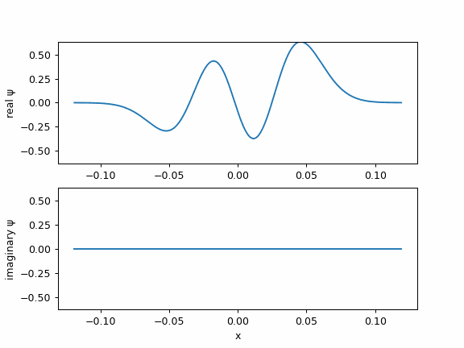

[](https://opensource.org/licenses/MIT)
[](https://www.python.org)
[]

# Quantum Harmonic Oscillator – Exact Time Evolution & Revivals




.


**A single-file, zero-dependency (beyond standard libraries) demonstration of exact quantum time evolution in the harmonic oscillator.**

Watch any superposition of energy eigenstates evolve analytically — no numerical integration, no approximations.  
Thanks to equally spaced energy levels, the wave function exhibits **perfect periodic revivals** every **T = 2π/ω**.

### What you’ll see
- Splitting, breathing, interference, and perfect reconstruction of the initial state
- Exact analytic solution using Hermite polynomials
- real + imaginary parts plotted in real time
- Automatically saves a  GIF

## Default initial state (feel free to change!)
```python

ψ(0) ∝ |0⟩ + 3|2⟩ + 7|3⟩
